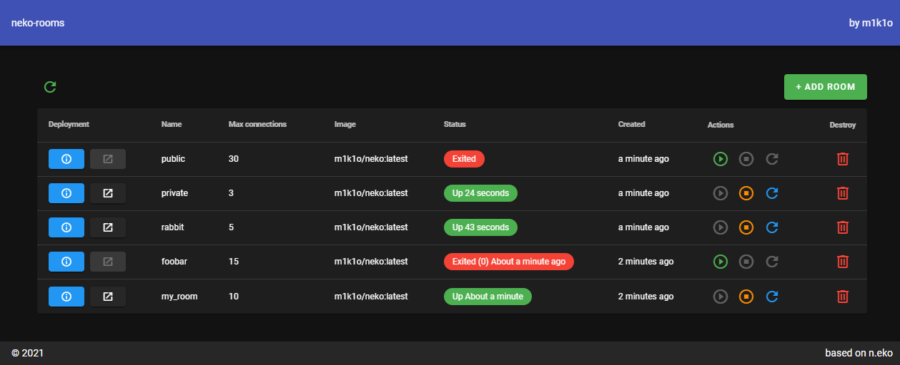
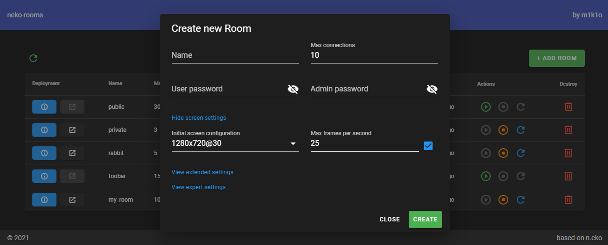

# neko-rooms

Simple room management system for [n.eko](https://github.com/m1k1o/neko). Self hosted rabb.it alternative.






## How to start

You need to have installed `Docker` and `docker-compose`. You need to have custom domain pointing to your server's IP.

You can watch installation video provided by *Dr R1ck*:

https://www.youtube.com/watch?v=cCmnw-pq0gA

### Installation guide

You only need `.env.example`, `docker-compose.yml` and `traefik/`.

### Step 1

Copy `.env.example` to `.env` and customize.

```bash
cp .env.example .env
```

### Step 2

Create `usersfile` with your users:

```bash
touch traefik/usersfile
```

And add as many users as you like:

```bash
echo $(htpasswd -nb user password) >> traefik/usersfile
```

### Step 3

Create `acme.json`

```bash
touch traefik/acme.json
chmod 600 traefik/acme.json
```

Update your email in `traefik/traefik.yml`.

### Roadmap:
 - [x] add GUI
 - [x] add HTTPS support
 - [x] add authentication provider for traefik
 - [ ] add bearer token to for API
 - [ ] add docker ssh / tcp support
 - [ ] add docker swarm support
