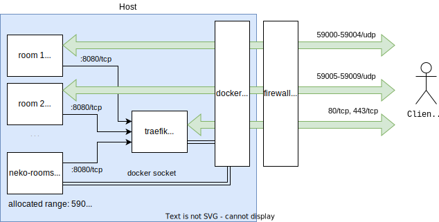

# Docs

Case study: having 2 rooms, every with max 5 users, they only need 10 ports to be forwarded so the range can be `59000-59009`.



All clients visit `https://neko-rooms/room-name/`. Once they logged in, they get one of the ports allocated where the RTC data flows. It happens inside SDP negotiation and is completly transparent to the clients. Therefore those ports needs to remain open, but they will never be actually visited directly in the browser.

`NEKO_ROOMS_NAT1TO1` must be the IP where the mentioned UDP ports are forwarded. If this setting is not present, it will get automatically servers public IP at start of every room that will be sent to clients.

## Connection timeout

Neko room loads but you don't see the screen and it gives you `connection timeout` or `disconnected error`? [Validate](https://neko.m1k1o.net/#/getting-started/troubleshooting?id=validate-udp-ports-reachability) that your UDP ports are reachable.

## path prefix

Room names are by default put to root directory. If you want to have custom path prefix, you can specify it using env variable:

```
NEKO_ROOMS_PATH_PREFIX=/test/
```

Now room will be available at `example.org/test/<room-name>` instead of `example.org/<room-name>`.

## using mux

When using mux, there will be allocated two ports per room: TCP and UDP port with the same number.

```
NEKO_ROOMS_MUX=true
```
