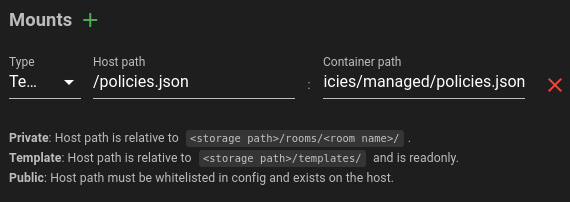

# Storage for neko-rooms

This needs to be specified in docker-compose:

```diff
  neko-rooms:
    image: "m1k1o/neko-rooms:latest"
    restart: "unless-stopped"
    environment:
      - "TZ"
      - "NEKO_ROOMS_EPR"
      - "NEKO_ROOMS_NAT1TO1"
      - "NEKO_ROOMS_TRAEFIK_DOMAIN"
      - "NEKO_ROOMS_TRAEFIK_ENTRYPOINT"
      - "NEKO_ROOMS_TRAEFIK_NETWORK"
      - "NEKO_ROOMS_INSTANCE_URL=http://${NEKO_ROOMS_TRAEFIK_DOMAIN}:8080/" # external URL
+      - "NEKO_ROOMS_STORAGE_ENABLED=true"
+      - "NEKO_ROOMS_STORAGE_INTERNAL=/data"
+      - "NEKO_ROOMS_STORAGE_EXTERNAL=/opt/neko-rooms/data"
    volumes:
      - "/var/run/docker.sock:/var/run/docker.sock"
+      - "/opt/neko-rooms/data:/data"
    labels:
      - "traefik.enable=true"
      - "traefik.http.services.neko-rooms-frontend.loadbalancer.server.port=8080"
      - "traefik.http.routers.neko-rooms.entrypoints=${NEKO_ROOMS_TRAEFIK_ENTRYPOINT}"
      - "traefik.http.routers.neko-rooms.rule=Host(`${NEKO_ROOMS_TRAEFIK_DOMAIN}`)"
```

Where:
- `NEKO_ROOMS_STORAGE_INTERNAL` is the directory inside the container.
- `NEKO_ROOMS_STORAGE_EXTERNAL` is the directory outside container.
- `"/opt/neko-rooms/data:/data"` is volume mount.

Please note, that **neko-rooms** must be aware of external storage path, as it is going to mount it to the room itself. That needs to be available to **neko-rooms** as well, in order to manage that folder.

Inside storage path (e.g. `/opt/neko-rooms/data`) there will be available these mount points:

- `/opt/neko-rooms/data/`**`rooms/<room name>/`** where will be stored private room data.
- `/opt/neko-rooms/data/`**`templates/`** where templates will be accessible.

## How can it be used?

You can mount e.g. browser policies and this way customize browser.

You can always refer to [google-chrome Dockerfile](https://github.com/m1k1o/neko/blob/1800d077d8138bdb23c25028bf4201a0469f91aa/.m1k1o/google-chrome/Dockerfile). In this case, policies are mounted to `/etc/opt/chrome/policies/managed/policies.json` path inside container. So you can mount custom file to this location what overwrites its content.

For this purpose, template path type is recommended, as policy file should only be readonly and can be reused along multiple rooms. You can then store your policies file to e.g. `/opt/neko-rooms/data/templates/policies.json` and have it mounted to all rooms.



## Mount path whitelist

If you want to mount any path from your filesystem, you need to whitelist it first.

Add it as environment variables to your docker compose:

```yaml
NEKO_ROOMS_MOUNTS_WHITELIST: "/media"
```

Or when using multiple, they can be separated white space:

```yaml
NEKO_ROOMS_MOUNTS_WHITELIST: "/home /media"
```

You can mount any path within your whitelisted path. Meaning, if you whitelisted `/home` folder you can selectively mount path e.g. `/home/ubuntu` to a room.

**NOTICE:** You could whitelist all paths on your system with `/`. From security perspective, this solution is *strongly discouraged*.
